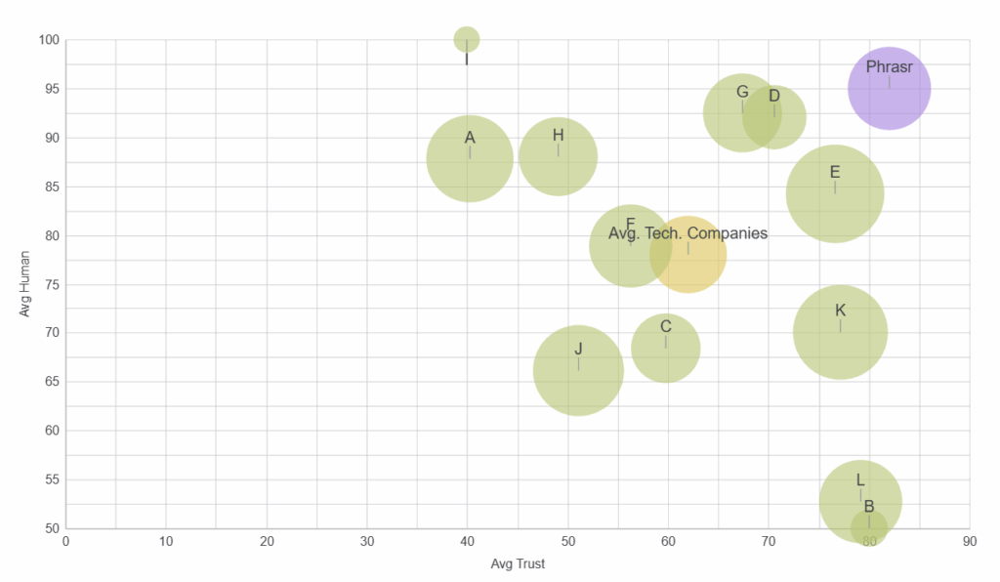
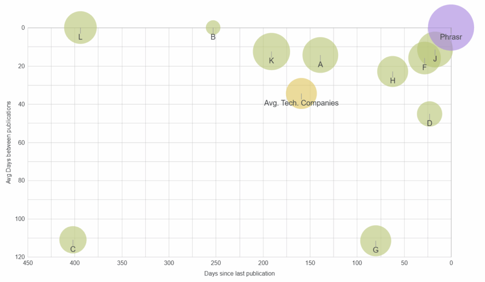
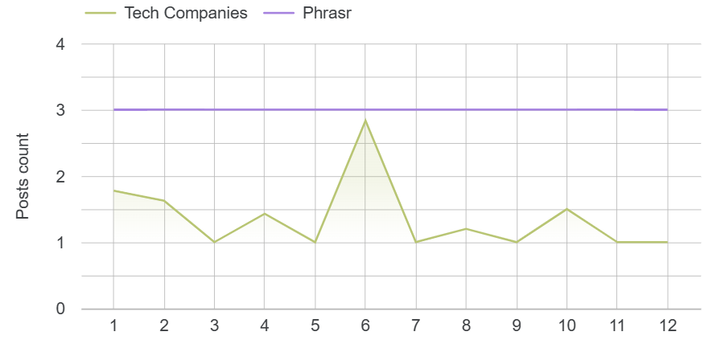

# Content Quality and Publishing Cadence in Technology Blogs

*Research*  
**Authors:** Mehdi Laanaït, Oussama Elgoumri, Philippe Kaivers  
**Date:** September 2025  

## Abstract  
Corporate blogs increasingly rely on large-language-model (LLM) tooling, yet questions remain about factual accuracy, human-likeness, and the ability to sustain a regular publishing cadence. This study evaluates recent posts from a randomly selected set of technology companies (>= 100 posts in total) and compares them to outputs produced by an automated content pipeline configured with two levels (“Lite” and “Pro”).

We operationalize three dimensions of content quality—Human-Likeness, Factuality & Source Quality, and Publishing Cadence—and report comparative descriptive statistics. In our sample, baseline corporate blogs cluster at Human-Likeness ~80–85/100 and Factuality & Source Quality ~60–70/100, with irregular and declining cadence over time (average inter-publication intervals of 30–60 days and long gaps (>150 days) for many blogs).

The automated pipeline attains higher scores on both Human-Likeness and Factuality & Source Quality and maintains a steady cadence (targeting three posts per period). We discuss measurement choices, limitations, and implications for teams aiming to balance quality with consistency.

## 1. Introduction  
Technology companies recognize the strategic value of communicating expertise (e.g., product updates, research notes, event recaps) through their blogs. However, three recurring challenges complicate sustained performance:

1. Factuality & Source Quality: LLM-assisted drafts risk hallucination and weak citation practices.  
2. Human-Likeness: Output can drift toward generic, machine-like phrasing that undermines engagement.  
3. Publishing Cadence: Editorial enthusiasm often decays, creating long gaps and loss of authority over time.

Automation promises scale and consistency, but evidence is needed to determine whether automated pipelines can match—or surpass—human-driven workflows on quality while also improving cadence. This study offers an empirical snapshot and measurement framework to inform that decision.

### Research Questions  
- **RQ1:** Do automated content pipelines achieve higher Factuality & Source Quality than current corporate-blog baselines?  
- **RQ2:** Do they sustain equal or higher Human-Likeness?  
- **RQ3:** Do they deliver more stable Publishing Cadence over time?

## 2. Related Considerations  
Prior work on factuality evaluation in LLM outputs emphasizes verifiability and source credibility; similarly, stylistic naturalness (“human-likeness”) and regularity of publication are known correlates of audience growth and search visibility. Our contribution is a practice-oriented, reproducible framework that measures all three dimensions concurrently and contrasts real-world corporate blogs with an automated pipeline configured for regular publishing and fact-checking.

## 3. Methodology  
### 3.1 Sampling Frame and Rationale  
We assembled a random sample of technology companies drawn from a neutral portfolio of startups/scale-ups. We focused on technology firms because they typically:

- Understand the importance of communicating expertise and events;  
- Are already experimenting with GPT-class tools; and  
- Possess sufficient technical maturity to operate a blog.

Inclusion/exclusion: One candidate had no blog (excluded). Three others had fewer than 10 posts and were excluded from time-series analyses. We targeted a minimum corpus of >100 posts across the remaining companies to enable descriptive analysis.

Observation window: Late Q3 2025.

### 3.2 Conditions  
We compare two conditions:

- **Baseline Corporate Blogs (BCB):** Public posts as published by the sampled companies.  
- **Automated Pipeline (AP):** Outputs produced by an automated writing + verification workflow under two configurations: AP-Starter and AP-Pro. Both configurations incorporate programmatic fact-checking with source attribution and style controls aimed at natural, human-like phrasing. AP-Pro applies stricter source filters and deeper interpretive cross-checks.

### 3.3 Measures  
We operationalize three dimensions. Detailed rubrics appear in Appendix A.

(A) **Human-Likeness Score (HS, 0–100).**  
A composite score penalizing repetitive or formulaic phrasing and rewarding clarity, variety, and reader-friendly rhythm.

(B) **Factuality & Source Quality (FSQ, 0–100)** with three sub-scores:  
- Global Veracity (GV): Consistency with up-to-date, verifiable facts.  
- Source Credibility (SC): Presence and quality of citations from authoritative sources.  
- Interpretive Clarity (IC): Accuracy and transparency of explanations that contextualize claims.

(C) **Publishing Cadence (PC)** using four indicators:  
- Avg. Inter-Publication Interval (IPI, days).  
- Days Since Last Publication (DSL, days).  
- Monthly Output Coefficient of Variation (CV). Lower is steadier.  
- Unique Active-Day Count (UAD) over the observation window.

### 3.4 Procedure  
1. **Data collection:** We retrieved recent posts, normalized dates, and deduplicated multi-publish events.  
2. **Scoring:** HS and FSQ metrics computed algorithmically; FSQ relies on automated retrieval and scoring of citations and interpretive statements.  
3. **Aggregation:** We report descriptive statistics by condition (BCB vs. AP-Starter vs. AP-Pro).

### 3.5 Analysis  
Given the modest sample size (company-level N), we emphasize descriptives (means/medians) and effect sizes. Formal significance testing is outside scope; instead, we focus on practical differences and confidence intervals where appropriate.

## 4. Results  
### 4.1 Human-Likeness and Factuality & Source Quality  
- BCB clustering: HS ~80–85/100; FSQ ~60–70/100, indicating solid but improvable writing naturalness and uneven citation/veracity practices.  
- Automated pipeline: Both AP-Starter and AP-Pro plot in the upper-right region of the HS×FSQ plane, reflecting simultaneously higher human-likeness and stronger factual/source discipline relative to BCB.

  

### 4.2 Publishing Cadence  
- BCB variability: Many companies exhibit DSL > 150 days and IPI of 30–60 days, with noticeable volatility (higher CV) and a declining UAD pattern over time (“exhaustion effect”).  
- Automated pipeline: Maintains near-zero DSL with a stable target of ~3 posts per period, yielding lower CV and more uniform UAD.

  

### 4.3 Observed “Exhaustion” Pattern  
Time-series of unique publication dates shows initial bursts followed by decay toward inactivity within ~6–12 months for a non-trivial share of BCB. The automated pipeline avoids this collapse by design through scheduled releases and guardrails that throttle volume without halting cadence.

## 5. Discussion  
Our results suggest that, in this sample, an automated pipeline can outperform current corporate blogs on both quality dimensions (HS and FSQ) and on sustained cadence (PC). Practically, this means teams can de-risk content operations by:

- Enforcing citation discipline and veracity checks;  
- Applying style constraints that maintain human-like readability; and  
- Scheduling outputs to prevent cadence collapse.

### Practical Takeaways  
- Treat factuality and sourcing as first-class citizens: wire them into the generation step.  
- Optimize for readability (sentence variety, structure, coherence) without drifting into templated phrasing.  
- Instrument cadence: track IPI, DSL, CV, and UAD monthly to detect early fatigue.

## 6. Limitations and Threats to Validity  
- Sample size and frame: Small, technology-focused sample may limit generalizability.  
- Instrumentation bias: Automated scoring is imperfect; HS and FSQ reflect specific rubrics and retrieval coverage.  
- Temporal effects: Observation in late 2025 may capture seasonal cycles or atypical periods.  
- Excluded blogs: Companies with less than 10 posts were excluded from time-series analysis, potentially biasing cadence comparisons.

## 7. Conclusion  
Within this sample of technology blogs, the automated pipeline achieved higher Human-Likeness and Factuality & Source Quality while maintaining a more stable publishing cadence than the baseline corporate blogs. While further work with larger, multi-sector samples is warranted, these results support the viability of automation for reliable, high-quality corporate publishing.

## Appendix A — Scoring Rubrics  

**Human-Likeness (HS)**  
- Fluency and coherence  
- Sentence-length and structure variety  
- Lexical diversity and specificity  
- Readability targets met  

**Factuality & Source Quality (FSQ)**  
- Global Veracity: alignment with up-to-date verifiable facts  
- Source Credibility: authoritative references with adequate coverage  
- Interpretive Clarity: accurate explanatory framing and transparency  

**Publishing Cadence (PC)**  
- Avg. Inter-Publication Interval (days)  
- Days Since Last Publication (days)  
- Monthly Output CV (0–1)  
- Unique Active-Day Count (absolute)  

## Appendix B — Metric Notes  
- **IPI:** arithmetic mean of day gaps between consecutive posts (per entity). Lower is better.  
- **DSL:** days between last observed publication date and observation cutoff. Lower is better.  
- **CV:** standard deviation / mean of monthly post counts over the window. Lower indicates steadier cadence.  
- **UAD:** count of unique dates with at least one post; useful to detect bursty vs. distributed behavior.

---

*(Footer / navigation / social elements from original omitted since they are not part of the core research content.)*
